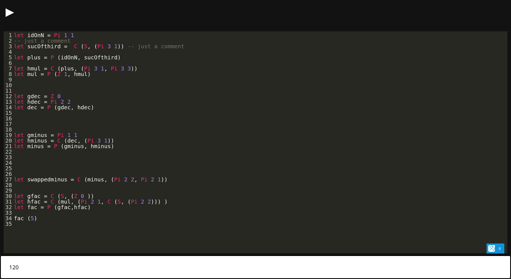

# Parser und Interpreter für primitiv rekursive Funktionen mit GADTs in Haskell


In diesem Repository befindet sich der Code für das Frontend meines Masterprojekt.
Hierfür wurde der Code aus diesem Repository entsprechend angepasst:

https://github.com/tommyengstrom/codemirror-elm

## Try it

```shell
npm install
elm make src/Main.elm --output main.js --debug
# stack install wai-app-static # To get the warp server
warp # Or serve it in your preferred way
```

Should look like this


